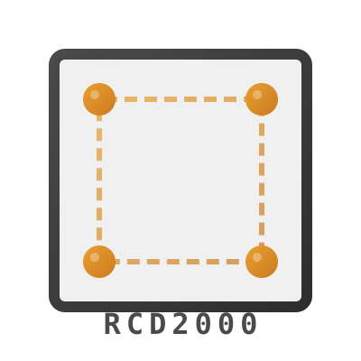
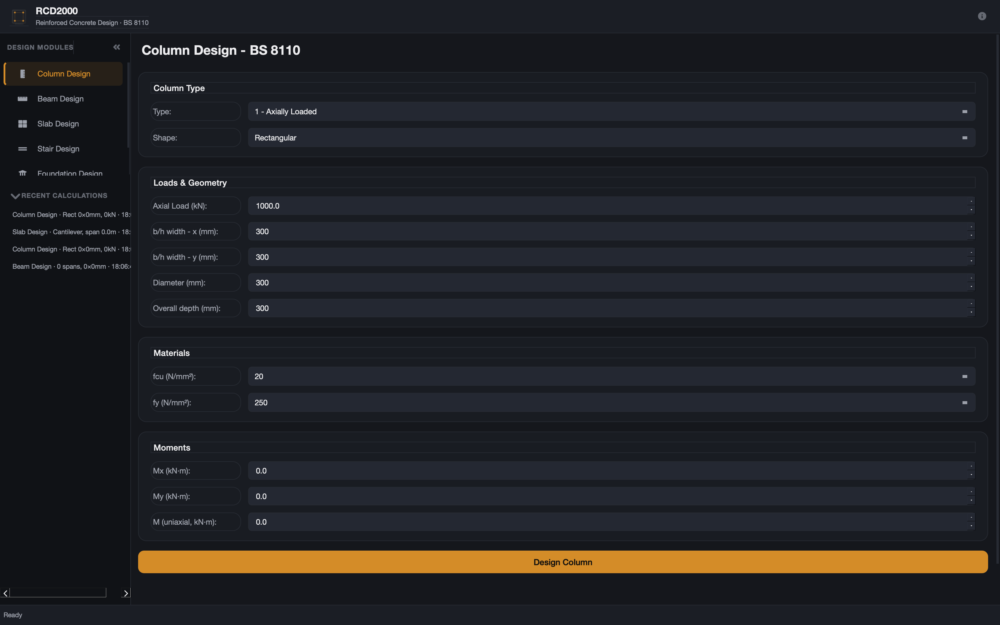

<p align="center">
  
</p>

<p align="center">
  <a href="https://github.com/Al-hussein31/rcd2000/releases/latest"></a>
  <a href="https://python.org"></a>
  <a href="LICENSE"></a>
  <a href="https://github.com/Al-hussein31/rcd2000/actions/workflows/build.yml"></a>
  <a href="https://github.com/Al-hussein31/rcd2000"></a>
  <a href="https://en.wikipedia.org/wiki/BS_8110"></a>
</p>

<p align="center">
  <strong>Reinforced concrete design to BS 8110:1997.</strong> Python port of Oyenuga's RCD2000 FORTRAN programs with a professional desktop GUI.
</p>

<p align="center">
  
</p>

RCD2000 is a structural engineering tool that designs beams, columns, slabs, stairs, and foundations in accordance with British Standard BS 8110. It uses the Clapeyron three-moment equation for continuous analysis and strain compatibility for column interaction curves.

---

## Downloads

| Platform | File | How to use |
|---|---|---|
| **Windows** | <a href="https://github.com/Al-hussein31/rcd2000/releases/latest/download/RCD2000-windows.exe">RCD2000-windows.exe</a> | Installer — run it, follow the setup wizard, launch from Start Menu. |
| **macOS** | <a href="https://github.com/Al-hussein31/rcd2000/releases/latest/download/RCD2000-macos.dmg">RCD2000-macos.dmg</a> | Open the DMG, drag the app to your Applications folder. See `HOW_TO_OPEN.txt` for first-launch steps. |
| **Linux** | <a href="https://github.com/Al-hussein31/rcd2000/releases/latest/download/RCD2000-linux.AppImage">RCD2000-linux.AppImage</a> | `chmod +x RCD2000-linux.AppImage && ./RCD2000-linux.AppImage` |
| **Terminal UI (any OS)** | `pip install "rcd2000[tui]"` | No binary needed — the TUI runs in any terminal on Windows, macOS, or Linux. See [TUI install](#terminal-ui-tui) below. |

> **How downloads work:** the Windows/macOS/Linux files above are GUI app bundles built automatically by the [GitHub Actions workflow](.github/workflows/build.yml) on every `v*` tag and attached to the [Releases page](https://github.com/Al-hussein31/rcd2000/releases). The TUI is the same Python package — there is nothing extra to download; install it with pip and run `rcd2000-tui`.

Or install via pip (CLI only or with GUI):

---

## Installing Python

Before you can use RCD2000 (either the TUI or the GUI), you need Python 3.11 or newer installed on your computer. Follow the instructions for your operating system below. Even if you have never used a terminal before, these steps will get you running.

### Windows

1. Go to [https://www.python.org/downloads/](https://www.python.org/downloads/)
2. Click the big yellow button **"Download Python 3.x.x"** (the latest version)
3. Run the downloaded `.exe` file
4. **Important:** On the first screen of the installer, check the box that says **"Add python.exe to PATH"** at the bottom — this is the most common mistake beginners make
5. Click **"Install Now"** and wait for it to finish
6. Open **Terminal** (press `Win` key, type `Terminal`, hit Enter)
7. Type this command and press Enter:
   ```bash
   python --version
   ```
   You should see something like `Python 3.12.x`. If you do, Python is installed correctly.

> **If `python` opens the Microsoft Store instead:** Search "Manage app execution aliases" in the Windows Start menu, turn off the Python aliases, and restart your terminal.

### macOS

1. Open **Terminal** (press `Cmd + Space`, type `Terminal`, hit Enter)
2. Check if Python is already installed:
   ```bash
   python3 --version
   ```
   If you see a version number (3.11 or newer), you're good — skip to step 5.
3. If Python is not installed or is too old, download the installer from [https://www.python.org/downloads/](https://www.python.org/downloads/)
4. Run the downloaded `.pkg` file and follow the installation wizard
5. Verify in Terminal:
   ```bash
   python3 --version
   ```

> **Note:** On macOS, always use `python3` (not `python`) and `pip3` (not `pip`) to make sure you're using Python 3.

### Linux

Most Linux distributions come with Python pre-installed. Open a terminal and check:

```bash
python3 --version
```

If Python 3 is already installed, you're ready to go. If not, install it with your distribution's package manager:

```bash
# Ubuntu / Debian
sudo apt update
sudo apt install python3 python3-pip

# Fedora / RHEL
sudo dnf install python3 python3-pip

# Arch Linux
sudo pacman -S python python-pip
```

### Online (no install needed)

If you just want to try Python in your browser without installing anything, you can use a free online Python interpreter:

- **[Python Playground](https://python-playground.com/online-python-interpreter)** — runs Python 3 in your browser, supports pip packages
- **[Playcode](https://playcode.io/python-compiler)** — full Python IDE in the browser, supports NumPy, Matplotlib, and more
- **[PyRun](https://pyrun.xyz/)** — lightweight, fast, runs entirely in your browser via WebAssembly

> **Note:** Online interpreters are great for testing Python code, but the RCD2000 TUI needs a real terminal to run. For the full TUI experience, install Python locally using the instructions above.

---

## Installation

### Quick install (CLI only)

```bash
pip install rcd2000
```

### With GUI (recommended)

```bash
pip install "rcd2000[gui]"
rcd2000-gui
```

### Terminal UI (TUI)

```bash
pip install "rcd2000[tui]"
rcd2000-tui
```

A DOSBox‑style retro Terminal UI with full keyboard navigation (Tab, F‑keys), retro amber-on‑dark‑blue styling, and support for all 6 design modules. Uses [Textual](https://textual.textualize.io/) framework.

### From source (development)

```bash
git clone https://github.com/Al-hussein31/rcd2000.git
cd rcd2000
pip install -e ".[gui,dev]"
```

### With development tools

```bash
pip install "rcd2000[dev]"       # pytest, coverage
pip install "rcd2000[gui,dev]"   # GUI + everything (add tui)
```

---

## Quick start

### GUI (desktop application)

```bash
rcd2000-gui
```

### Terminal UI (TUI)

```bash
rcd2000-tui
```

Run it in any terminal — no window server needed, works over SSH too.

### CLI

```bash
# Design a beam from a JSON input file
rcd2000 beam input.json

# Show formatted report
rcd2000 beam input.json -o results.txt

# Export as JSON
rcd2000 beam input.json --json

# List available modules
rcd2000 info
```

### Python API

```python
from rcd2000.beam import BeamDesigner, BeamInput

designer = BeamDesigner(fcu=25, fy=460)
beam_input = BeamInput(
    beam_id="B1", n_supports=2, n_members=1,
    b=225, h=450, hf=0, bf=225,
    member_lengths=[6.0], member_udl=[25.0],
)
results = designer.design([beam_input])
```

---

## Modules

| Command | Design type | Methods |
|---|---|---|
| `beam` | Simply supported and continuous beams | Clapeyron three-moment, moment redistribution, shear link design, deflection check |
| `column` | Axial, uniaxial, and biaxial columns | Strain compatibility, Nu/Mu interaction curves, biaxial ratio check (BS 8110) |
| `slab` | Cantilever, simply supported, continuous one-way, two-way | Moment coefficients, span-depth ratios, two-way table coefficients |
| `stair` | Straight-flight stairs | Waist slab design, effective span, imposed load distribution |
| `base` | Square isolated, rectangular isolated, combined footings | Bearing pressure, punching shear, local bond, combined footing centroid method |
| `continuous-beam` | Continuous beam analysis (no design) | Clapeyron three-moment equation, support moment distribution |

| Interface | Command | Description |
|---|---|---|
| Terminal UI | `rcd2000-tui` | Retro DOS-style TUI with keyboard navigation for all 6 modules |

---

## Input format

Each module accepts a JSON file with material properties and geometric parameters:

```json
{
  "fcu": 25,
  "fy": 460,
  "beams": [
    {
      "beam_id": "B1",
      "n_supports": 2,
      "b": 225,
      "h": 450,
      "member_lengths": [6.0],
      "member_udl": [25.0]
    }
  ]
}
```

Full input schemas with all parameters are available in the module documentation. See `tests/test_validation.py` for working examples.

---

## Validation

Every design module is verified against the original FORTRAN 77 source output. The test suite confirms:

- 64 automated tests all passing (35 design validation + 29 state/persistence)
- Numerical agreement within 1% of FORTRAN reference values
- Edge cases discovered and corrected (including a latent array bug in the original FORTRAN)
- Punching shear unit mismatch identified and fixed (N/m² vs N/mm²)

Run the tests:

```bash
python3 -m pytest tests/ -v
```

---

## Reference

The original RCD2000 was authored by V.O. Oyenuga and published in *Reinforced Concrete Design to BS 8110 -- Simply Explained* (1999). The 13 FORTRAN 77 source files are preserved in `references/` for audit and verification.

| File | Program |
|---|---|
| `beam_main.f77`, `beam_subs.f77` | Beam analysis and design |
| `bmdsgn.f77` | Beam moment redistribution |
| `column.f77` | Column design |
| `slab_main.f77`, `slab_subs.f77` | Slab design |
| `stair.f77` | Stair design |
| `base.f77` | Foundation design |
| `continuous_beam.f77` | Continuous beam analysis |
| `utility_subs.f77`, `disctf.f77`, `ploss.f77` | Utility routines |
| `sample.f77` | Sample problem data |

---

## Contributing

Contributions are welcome. Open an issue or pull request on [GitHub](https://github.com/Al-hussein31/rcd2000).

---

## License

MIT
